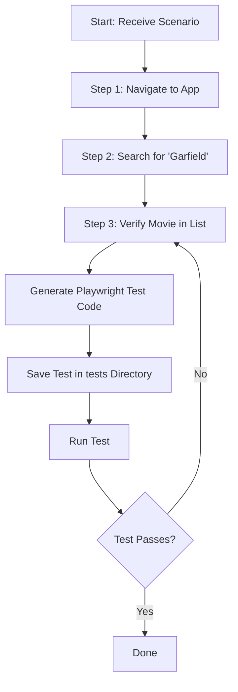

# Playwright Test Generation Demo

## References
- [YouTube: Generate Playwright tests without code access](https://www.youtube.com/watch?v=AaCj939XIQ4)
- [Blog: Generate Playwright tests without code access](https://debbie.codes/blog/generate-playwright-tests-without-code-access)

## How to Use Prompts
This demo uses the prompt file [`generate_test.prompt.md`](.github/prompts/generate_test.prompt.md) to guide the agent in generating Playwright tests step-by-step. The agent will:
- Run each scenario step using Playwright MCP tools
- Only generate test code after all steps are completed
- Save the generated test in the `tests` directory
- Execute the test and iterate until it passes

### Example Prompt
```
Generate a Playwright test for the following scenario:
1. Navigate to https://debs-obrien.github.io/playwright-movies-app
2. search for 'Garfield'
3. verify the movie is in the list
```

## Workflow Diagram

